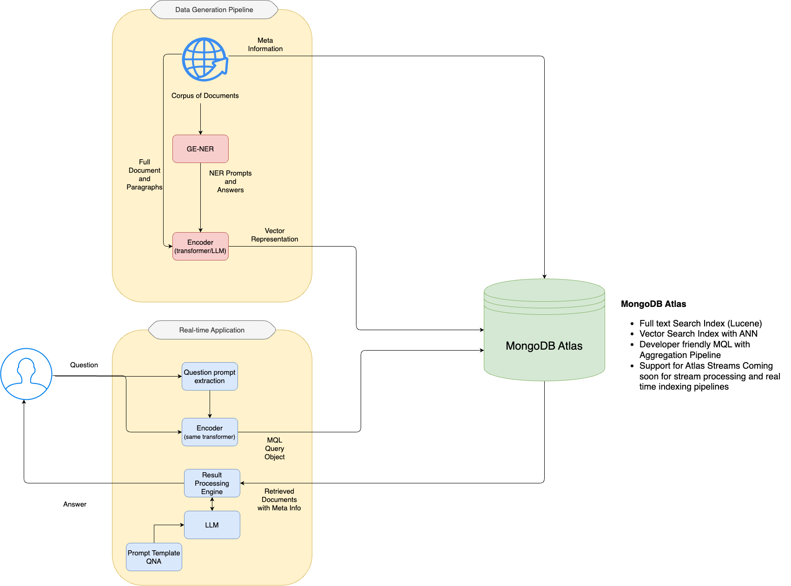

## Vector Search + GEN AI Application Demo for Innovaare
Using MongoDB as the vector search store to store both the Vector representation of all documents + Meta information can help customers achieve a personalized/customized Q&A or chatbot experience with their own data or corpus. Steps to achieve the same.

Currently a vannilla vector search implementation is demonstrated with the repo. This repo will be incrimentally updated to carry a QNA using the LLM and prompt engineering technique

<center></center>

Here are some steps to implement the web page context:
* Choose a pre-trained QA model and tokenizer from the Hugging Face library, such as BERT or DensePhrases.
* Define the natural language question prompts for the entity types of interest, such as “Which people?” or “Which locations?”.
* Load a corpus of text documents from which to extract entities, such as Wikipedia or your own domain-specific data.
* For each document in the corpus, apply the QA model with each question prompt to retrieve candidate entities and sentences.
* Apply some normalization rules to clean and filter the candidate entities, such as removing punctuation, trimming whitespace, and matching case.
* Save the candidate entities and sentences as a NER dataset in a suitable format, such JSON or Document.
* Now to perform the Question answering task index the data in mongodb vector store and prepare the vector index on the relevant field.
* So the QNA functionalitity can be achieved in two ways on top on custom or local knowledge base using a privately hosted LLM
    * Using Prompt Engineering and results from Vector store
    * Using QA chain from LangChain along with Vector Store
 


# Steps to run the demo

## 1. Install the dependencies

1. Instructions to install the LLM are in the link below
https://agi-sphere.com/install-llama-mac/
https://python.langchain.com/docs/modules/model_io/models/llms/integrations/llamacpp
2. Install requirements.txt using the following command
```bash
pip3 install requirements.txt
```
3. Run the Notebook `./notebooks/qna_with_plain_vector_search.ipynb`


